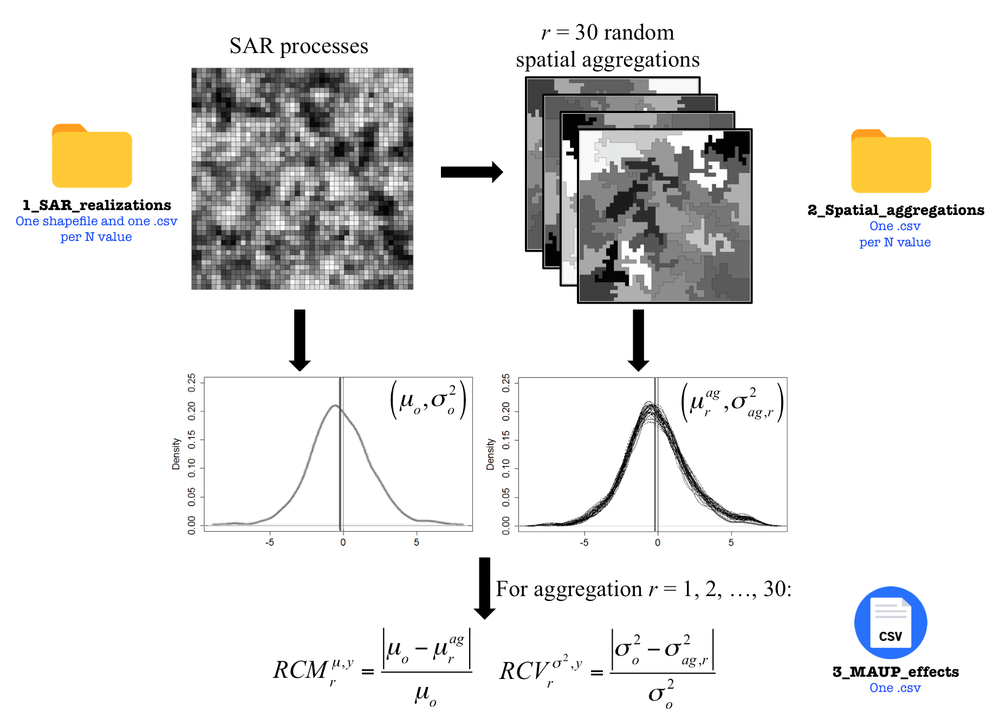

## S-maup: Statistical Test to Measure the Sensitivity to the Modifiable Areal Unit Problem


Juan C. Duque<sup>1,2</sup>, Henry Laniado<sup>1</sup>, Adriano Polo<sup>2,3</sup>


<sup>1</sup> Department of Mathematical Sciences, Universidad EAFIT, Medellin, Colombia

<sup>2</sup> RiSE-group, Universidad EAFIT, Medellin, Colombia

<sup>3</sup> Department of Economics, Universidad EAFIT, Medellin, Colombia


__maintainer__ = "RiSE Group"  (http://www.rise-group.org/). Universidad EAFIT

__Corresponding author__ = jduquec1@eafit.edu.co (JCD)

### Abstract 

This work presents a nonparametric statistical test, S-maup, to measure the sensitivity of a spatially intensive variable to the effects of the Modifiable Areal Unit Problem (MAUP). To the best of our knowledge, S-maup is the first statistic of its type and focuses on determining how much the distribution of the variable, at its highest level of spatial disaggregation, will change when it is spatially aggregated.  Through a computational experiment, we obtain the basis for the design of the statistical test under the null hypothesis of non-sensitivity to MAUP.  We performed an exhaustive simulation study for approaching the empirical distribution of the statistical test, obtaining its critical values, and computing its power and size. The results indicate that, in general, both the statistical size and power improve with increasing sample size. Finally, for illustrative purposes, an empirical application is made using the Mincer equation in South Africa, where starting from 206 municipalities, the $S$-maup statistic is used to find the maximum level of spatial aggregation that avoids the negative consequences of the MAUP.

# Run the S-maup.

[<span style="color:red">Download the code</span>](data/results.csv)


```tex
@article{XX,
    author = {Duque, Juan C. AND Laniado, H. AND Polo, A.},
    journal = {PLOS ONE},
    publisher = {Public Library of Science},
    title = {S-maup: Statistical Test to Measure the Sensitivity to the Modifiable Areal Unit Problem},
    year = {2018},
    month = {mm},
    volume = {vv},
    url = {xx},
    pages = {1-25},
    abstract = {This work presents a nonparametric statistical test,  S-maup, to measure the sensitivity of a spatially intensive variable to the effects of the Modifiable Areal Unit Problem (MAUP). To the best of our knowledge,  S-maup is the first statistic of its type and focuses on determining how much the distribution of the variable, at its highest level of spatial disaggregation, will change when it is spatially aggregated. Through a computational experiment, we obtain the basis for the design of the statistical test under the null hypothesis of non-sensitivity to MAUP. We performed an exhaustive simulation study for approaching the empirical distribution of the statistical test, obtaining its critical values, and computing its power and size. The results indicate that, in general, both the statistical size and power improve with increasing sample size. Finally, for illustrative purposes, an empirical application is made using the Mincer equation in South Africa, where starting from 206 municipalities, the  SS -maup statistic is used to find the maximum level of spatial aggregation that avoids the negative consequences of the MAUP.},
    number = {nn},
    doi = {xx}
}
```


```python
import smaup as smaup
```


```python
N = 150
k = 90
rhoEst = 0.801
testSmaup(N, k, rhoEst)
```

# Computational Experiment on MAUP effects




## Folder: <span style="color:red">1_SAR_realizations</span>

Fields description:

**Variable name** | **Description**
  ----------------- | -------------------------------------------------------------------------
  `ID`       | Area ID
  `SAR<realization ID>_<rho value>`      | SAR instances: SAR1_0.9, SAR2_0.9, SAR3_0.9,..., SAR50_0.9,..., SAR1_-0.9, SAR2_-0.9, SAR3_-0.9,..., SAR48_-0.9, SAR49_-0.9, SAR50_-0.9


```python
#ir a folder
```


```python
# leer un csv
```


```python
# visualizar primeros registros
```


```python

```


```python

```

# Tables:

### Table 2. Effect on mean.

[<span style="color:red">code</span>](data/results.csv)

[data](https://www.dropbox.com/sh/ns8s59b2bkx2ypr/AABwzjdBzD33yFw6-2amEH5Va?dl=0)


<a href="https://www.dropbox.com/sh/ns8s59b2bkx2ypr/AABwzjdBzD33yFw6-2amEH5Va?dl=0" target="_blank">data2</a>

### Table 3. Critical Values ($M_{\alpha;\rho, N}$).


```python

```

### Table 4. Example $S$-maup.


```python

```

### Table 5. Estimated power of $S$-maup.


```python

```

### Table 6. Estimated size of $S$-maup.


```python

```

### Table 7. Descriptive Statistics.


```python

```

### Table 8. Mincer Model Estimate: South Africa.


```python

```

### Table 9. Estimator of the statistic $S$-maup: South Africa.


```python

```

# Figures:

### Figure 3. Relative change in mean - Average effect. (a) $N=25$; (b) $N=100$; (c) $N=225$; (d) $N=400$; (e) $N=625$; (f) $N=900$.


```python

```

### Figure 4. Relative change in variance - Average effect. (a) $N=25$; (b) $N=100$; (c) $N=225$; (d) $N=400$; (e) $N=625$; (f) $N=900$.


```python

```

### Figure 5. Proportion of instances for which the Levene test rejects the null hypothesis of equality of variance, with a level of significance $\alpha=0.05$. (a) $N=25$; (b) $N=100$; (c) $N=225$; (d) $N=400$; (e) $N=625$; (f) $N=900$.    


```python

```

### Figure 6. MAUP effects at three levels of spatial autocorrelation, (a) $\rho=-0.9$, (b) $\rho=0$, and (c) $\rho=0.9$. Solid line: original variable with $N=900$; dashed lines: 30 aggregations with $k=240$. The vertical lines indicate $\mu_{o}$ and $\mu_{ag}$.


```python

```

### Figure 7. Median $\overline{RCM}$ for $N=100$.


```python

```

### Figure 8. Adjustments of robust linear regression models: (a) Linearized logistic function ($L$); (b) Linearized power function ($\eta$); (c) Linear function ($\tau$).


```python

```

### Figure 9. Municipalities: (a), (b) and (c). Districts: (d), (e) and (f). Provinces:(g), (h) and (i).


```python

```

### Figure 10. Distribution of coefficients, $k=136$: (a) YRSCHOOL; (b) EXP; (c) EXP2. horizontal black line: coefficient (206 municipalities), dashed lines are the respective confidence intervals 95\%.


```python

```

### Figure 11. Distribution of coefficients. line:$k=136$, dotted line:$k=52$: (a) YRSCHOOL; (b) EXP; (c) EXP2. horizontal black line: coefficient (206 municipalities). horizontal dotted line: coefficient (52 districts).


```python

```
